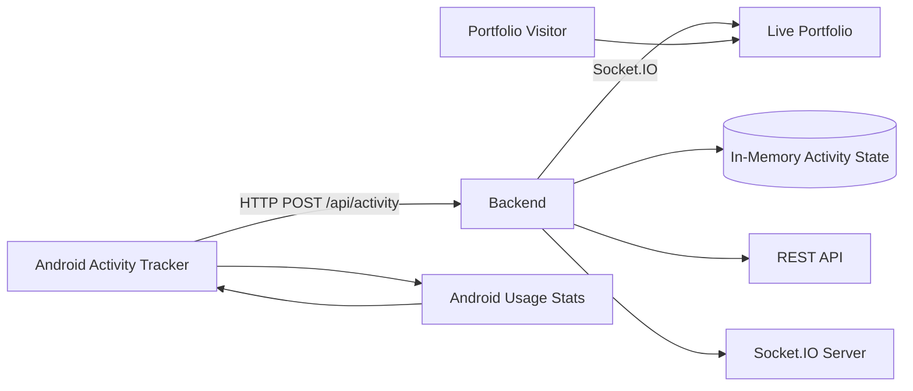

# Anurag Mishra — Full-Stack Developer Portfolio

> A personal developer portfolio built to showcase projects, skills, experience, and engineering work — with a real-time Activity Tracker that shows what the portfolio owner is currently doing.

🌐 **Live Portfolio:** https://anuragnibhamishra.vercel.app/

---

## Overview

This project is my personal developer portfolio, designed not only as a collection of projects but as a small full-stack product.

The portfolio combines a modern frontend with a custom backend and an Android Activity Tracker. The tracker detects the application currently being used on the portfolio owner's Android device and streams that activity to the live portfolio in real time.

For example:

- 🎵 Spotify → **Listening to Spotify**
- ▶️ YouTube → **Watching YouTube**
- 📸 Instagram → **Scrolling Instagram**
- ♟️ Chess → **Playing Chess**
- 🌐 Chrome → **Browsing Chrome**
- 💬 WhatsApp → **Available on WhatsApp**
- 🔒 Phone locked → **Working on laptop**

Visitors see the portfolio owner's live activity — **not their own device activity**.

---

## ✨ Features

### Portfolio

- Modern responsive portfolio website
- Home page
- About section
- Projects showcase
- Skills / technologies
- Contact section
- Responsive navigation
- Smooth UI interactions
- Custom visual design and animations
- Mobile-friendly layout

### Real-Time Activity Tracker

- Detects the foreground application on Android
- Converts package names into human-readable activities
- Sends activity updates to the backend
- Uses Socket.IO for real-time communication
- Displays the owner's current activity on the portfolio
- Automatically reconnects when the connection is interrupted
- Handles disconnects and network failures gracefully

### Backend

- REST API for activity management
- Socket.IO real-time communication
- Activity creation endpoint
- Current activity endpoint
- Activity clearing endpoint
- CORS configuration
- Production environment configuration
- Deployed independently from the frontend

### Android

- Android Activity Tracker
- Usage Access permission
- Foreground activity detection
- Network communication with production backend
- Human-readable activity mapping
- Production-ready APK

---

# 🏗️ Architecture



### Data Flow

```text
Android Device
      │
      │ Detect foreground application
      ▼
Activity Tracker
      │
      │ POST /api/activity
      ▼
Backend
      │
      ├── Store current activity
      │
      └── Emit activity:update
                │
                │ Socket.IO
                ▼
        Portfolio Website
                │
                ▼
       Live Activity UI
```

---

# 🧩 Project Structure

```text
portfolio-ecosystem/
│
├── MyPortfolio/
│   ├── src/
│   ├── public/
│   ├── package.json
│   └── ...
│
├── android/
│   ├── app/
│   ├── gradle/
│   ├── build.gradle
│   └── ...
│
├── backend/
│   ├── src/
│   │   ├── config/
│   │   ├── routes/
│   │   ├── socket/
│   │   └── ...
│   │
│   ├── package.json
│   ├── tsconfig.json
│   └── ...
│
└── README.md
```

---

# 🛠️ Tech Stack

## Frontend

- React
- JavaScript
- Vite
- Tailwind CSS
- Socket.IO Client

## Backend

- Node.js
- TypeScript
- Express
- Socket.IO
- dotenv

## Android

- Kotlin
- Android SDK
- UsageStatsManager
- Foreground activity detection
- HTTP networking

## Deployment

- Vercel — Frontend
- Railway — Backend

---

# ⚡ Real-Time Activity System

The most interesting part of this project is the Activity Tracker.

The Android application detects which application is currently in the foreground.

For example:

```text
com.spotify.music
        ↓
Listening to Spotify
```

```text
com.instagram.android
        ↓
Scrolling Instagram
```

```text
com.android.chrome
        ↓
Browsing Chrome
```

The Android application sends the resulting activity to the backend.

The backend then broadcasts the update through Socket.IO.

```text
Android
   │
   │ POST /api/activity
   ▼
Backend
   │
   │ activity:update
   ▼
Socket.IO Clients
   │
   ▼
Portfolio UI
```

This means visitors don't need to refresh the website to see activity changes.

---

# 🔌 API

## Health Check

```http
GET /api/health
```

Example response:

```json
{
  "success": true,
  "message": "Activity Tracker API is running"
}
```

---

## Create Activity

```http
POST /api/activity
```

Example payload:

```json
{
  "app": "Spotify",
  "packageName": "com.spotify.music",
  "action": "Listening to Spotify",
  "startedAt": 1788549292692
}
```

Example response:

```json
{
  "success": true,
  "data": {
    "app": "Spotify",
    "packageName": "com.spotify.music",
    "action": "Listening to Spotify",
    "startedAt": 1788549292692,
    "receivedAt": 1788549293230
  }
}
```

---

## Get Current Activity

```http
GET /api/activity
```

Returns the currently tracked activity.

---

## Clear Activity

```http
POST /api/activity/clear
```

Clears the current activity and notifies connected clients.

---

# 🔄 Socket.IO Events

The portfolio communicates with the backend using Socket.IO.

### `activity:current`

Sent when a client initially connects.

```json
{
  "app": "Spotify",
  "packageName": "com.spotify.music",
  "action": "Listening to Spotify"
}
```

### `activity:update`

Sent whenever the owner's activity changes.

```json
{
  "app": "Instagram",
  "packageName": "com.instagram.android",
  "action": "Scrolling Instagram"
}
```

### Connection Lifecycle

The frontend handles:

```text
connect
connect_error
disconnect
reconnect
reconnect_attempt
reconnect_error
```

This allows the Activity Tracker UI to represent the current connection state.

---

# 📱 Android Activity Mapping

| Application | Displayed Activity |
|---|---|
| Spotify | Listening to Spotify |
| YouTube | Watching YouTube |
| Instagram | Scrolling Instagram |
| Chess | Playing Chess |
| Chrome | Browsing Chrome |
| WhatsApp | Available on WhatsApp |
| Phone Locked | Working on laptop |

Unknown applications are handled separately rather than exposing arbitrary package names to visitors.

---

# 🔐 Privacy

The Activity Tracker is intentionally designed around the portfolio owner's device.

**It does not track the visitor's activity.**

The live activity displayed on the portfolio represents:

> **The portfolio owner's current activity — not yours.**

The Android application requires Usage Access permission because Android restricts access to foreground application information.

No visitor-side application tracking is performed.

---

# 🚀 Running Locally

## 1. Clone the repository

```bash
git clone <your-repository-url>
cd portfolio-ecosystem
```

---

## 2. Frontend

```bash
cd MyPortfolio
npm install
npm run dev
```

The frontend will run on:

```text
http://localhost:5173
```

---

## 3. Backend

```bash
cd backend
npm install
npm run dev
```

The backend will run on:

```text
http://localhost:5000
```

---

## 4. Environment Variables

### Backend

Create:

```text
backend/.env
```

Example:

```env
PORT=5000
ALLOWED_ORIGIN=http://localhost:5173
```

### Frontend

For local development:

```env
VITE_ACTIVITY_API_URL=http://localhost:5000
```

For production:

```env
VITE_ACTIVITY_API_URL=https://myportfolio-production-5da1.up.railway.app
```

> Never commit `.env` files containing secrets. Use `.env.example` to document required variables.

---

# 🌍 Production

The frontend is deployed on Vercel and the backend is deployed on Railway.

### Frontend

https://anuragnibhamishra.vercel.app/

### Backend

https://myportfolio-production-5da1.up.railway.app/

### Backend Health Check

```text
/api/health
```

---

# 🧪 Testing

The backend includes validation for:

- Health endpoint
- Activity creation
- Current activity retrieval
- Activity clearing
- Socket.IO connection
- Activity update events
- Duplicate activity handling
- Reconnection
- CORS
- Production build

A Socket.IO smoke test is also available for validating real-time events.

Example:

```bash
npm run socket:test
```

---

# 📦 Building the Android APK

From Android Studio:

```text
Build
   ↓
Generate App Bundle / APK
   ↓
Generate APK
```

The generated release APK can then be installed on the Android device running the Activity Tracker.

---

# 🧠 Engineering Decisions

## Why Socket.IO?

A traditional REST-only architecture would require the portfolio to repeatedly poll the backend.

Instead:

```text
Polling:

Portfolio → Backend
Portfolio → Backend
Portfolio → Backend
Portfolio → Backend
```

Socket.IO allows the backend to push changes:

```text
Android → Backend → Portfolio
                    ↓
              instant update
```

This makes the live activity feature more responsive and reduces unnecessary polling.

---

## Why TypeScript for the Backend?

The portfolio frontend is written in JavaScript while the backend uses TypeScript.

This is completely intentional.

The frontend and backend are separate applications communicating through an HTTP/Socket.IO contract, so they do not need to use the same language.

TypeScript provides:

- Better type safety
- Safer API payloads
- Better maintainability
- Improved IDE support
- Easier refactoring

---

## Why Keep Activity State In Memory?

The Activity Tracker currently only needs the owner's **current activity**, not historical analytics.

Therefore the backend stores the current state in memory.

```text
Server Restart
      ↓
Activity State Cleared
```

This is sufficient for the current implementation and avoids introducing a database where one isn't required.

A future version could persist activity history if analytics become necessary.

---

# 🎯 Design Goals

The project was built around a few principles:

### 1. Keep the portfolio personal

Instead of being a static resume website, the portfolio should communicate what I'm actually doing.

### 2. Build something technically interesting

The Activity Tracker adds a real full-stack component to an otherwise frontend-focused portfolio.

### 3. Keep the architecture simple

The system intentionally avoids unnecessary infrastructure.

```text
Android
   ↓
Express + Socket.IO
   ↓
React
```

### 4. Ship the product

The project is deployed and accessible publicly rather than existing only as a local development project.

---

# 📈 Future Improvements

Potential future iterations include:

- Activity history
- Daily / weekly activity statistics
- Activity timeline
- Persistent database storage
- Authentication for the Android tracker
- Better offline synchronization
- More application mappings
- Activity duration tracking
- Analytics dashboard
- Deployment automation
- Automated testing pipeline

---

# 📚 What I Learned

Building this project involved working across multiple layers of a software system:

- React application architecture
- REST API design
- TypeScript backend development
- Socket.IO
- Real-time event handling
- Android application development
- Android Usage Access APIs
- Foreground service architecture
- CORS configuration
- Environment variables
- Production deployment
- Vercel + Railway integration
- Debugging network connectivity
- APK generation and release

The most important takeaway was learning how to connect multiple independently deployed systems into a single working product.

---

# 👨‍💻 Author

**Anurag Mishra**

Software Developer focused on building web applications and full-stack products.

🌐 Portfolio:  
https://anuragnibhamishra.vercel.app/

---

## ⭐ Project Status

**Status: Shipped 🚀**

The portfolio is live, the backend is deployed, and the Android Activity Tracker is connected to the production system.

```text
Frontend       ✅ Live
Backend        ✅ Live
REST API       ✅ Working
Socket.IO      ✅ Working
Android App    ✅ Working
Activity Sync  ✅ Working
Production     ✅ Deployed
```

---

## 📄 License

This project is primarily a personal portfolio project.

The source code is available for learning and reference. Please do not directly copy the portfolio design, branding, or personal content for another portfolio.